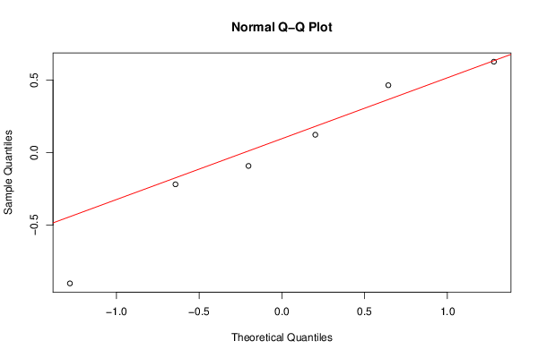

가.

#### 확률변수 설정 및 분포 ####

$$ Y_ i = \alpha + \beta \cdot x_ i + \epsilon_ i $$



따라서

$$ Y_ i = \alpha + \beta x_ i + \epsilon \sim N( \alpha+\beta x_ i, \sigma ^2) $$

#### 회귀계수 추정량 도출 ####



나.

<table>
<tr>
<td>$x$</td>
<td>1</td>
<td>2</td>
<td>3</td>
<td>5</td>
<td>6</td>
<td>8</td>
</tr>
<tr>
<td>$y$</td>
<td>0.1</td>
<td>0.15</td>
<td>0.2</td>
<td>0.3</td>
<td>1.5</td>
<td>3</td>
</tr>
<tr>
<td>$R_ x$</td>
<td>1</td>
<td>2</td>
<td>3</td>
<td>4</td>
<td>5</td>
<td>6</td>
</tr>
<tr>
<td>$R_ Y$</td>
<td>1</td>
<td>2</td>
<td>3</td>
<td>4</td>
<td>5</td>
<td>6</td>
</tr>
</table>

$R_ x$, $R_ Y$ 는 각각 $x$, $Y$ 의 오름차순 순위를 말한다.

#### Pearson 상관계수 ####

$$ r = \frac{\sqrt{\sum_ i(x_ i - \bar x)(Y_ i - \bar Y)}}{\sqrt{\sum_ i(x_ i - \bar x)^2} \sqrt{\sum_ i(Y_ i - \bar Y)^2}} = \frac{S_ {xY}}{\sqrt{S_{xx} \cdot S_{YY}}} = \frac{81.75/6}{209/6 \cdot 40.9125/6} = 0.88407 $$

#### Spearman 상관계수 ####

$$ r_ S = 1- \frac{6 \sum (R_ {x, i} - R_ {Y, i})^2}{n(n^2 - 1)} = 0 $$

다.

회귀직선에 의한 추정값 $ \hat Y_ i = a + b \cdot x_ i $, 잔차 $ e_ i = Y_ i - \hat Y_ i$ 로 정의하면

<table>
<tr>
<td>$x$</td>
<td>1</td>
<td>2</td>
<td>3</td>
<td>5</td>
<td>6</td>
<td>8</td>
</tr>
<tr>
<td>$y$</td>
<td>0.1</td>
<td>0.15</td>
<td>0.2</td>
<td>0.3</td>
<td>1.5</td>
<td>3</td>
</tr>
<tr>
<td>$\hat Y$</td>
<td>-0.364</td>
<td>0.028</td>
<td>0.419</td>
<td>1.201</td>
<td>1.592</td>
<td>2.374</td>
</tr>
<tr>
<td>$e$</td>
<td>0.464</td>
<td>0.123</td>
<td>-0.219</td>
<td>-0.901</td>
<td>-0.092</td>
<td>0.626</td>
</tr>
</table>

#### 선형성 및 등분산성 검토 ####
$ x $나 $ \hat Y $ 에 따른 잔차의 산점을 보아 판단한다. 이하에서는 $ x $ vs $ e $ 산점도로 분석한다.

$x$가 커질 수록 잔차가 감소했다가 증가하는 경향이 있다.
이는 적합된 선형회귀식보다 실제 관측치 $Y$ 가 더 급히 증가하기에 발생하는 현상이다.
이 경우 선형 모형을 2차 이상 다항함수 모형이나 지수함수 모형 등으로 대체하는 것이 바람직하다.

#### 정규성 검토 ####
줄기잎그림과 상자그림, 히스토그램 등을 그려 정규성을 지니는지 대략적으로 확인할 수 있다.
하지만 통상 정규확률그림을 그려 직선 모양을 취하는지 여부로 정규성을 검토한다.

표본 크기가 작아 단정하기 어렵지만 정규확률그림상 직선에 가까우므로 정규성을 가진다고 본다.

#### 독립성 검토 ####
통상 Durbin-Watson 검정으로 독립성을 검토한다. 혹은 잔차를 측정순서에 따라 산점도를 그려 대략적으로 검토한다.
이하에서 표본이 나열된 순서 $i$ 가 곧 관측된 순서라 가정한다.

$ i $ 가 관측순서가 맞다면 주어진 자료는 앞선 관측에 오차항이 상관성을 지니는 경향이 있는 것으로 보인다. 잔차가 감소했다가 증가하는 일정한 경향성이 있기 때문이다.

